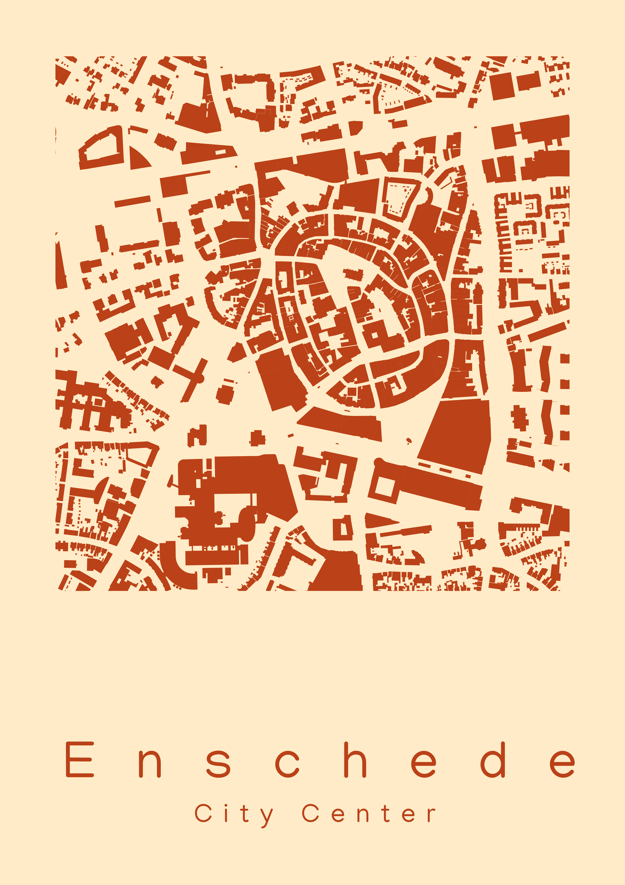

## Day 1 : Points

*The graph shows the comparison of predicted forest and farms fires in India against actual fires in India with each point representing a 25 square kilometer area. The color scale indicates the number of fires, with darker shades representing higher fire counts*

## Day 2 : Lines

*The graph depicts the elevation profile of a watershed in São Paulo, Brazil.*

## Day 3 : Polygons

*The map visualizes the global carbon dioxide emissions from forest and agricultural fires in 2021, with a color scale ranging from 100 to 1000 megatons. Darker shades indicate higher emissions.*

## Day 4 : A Bad Map

## Day 5 : Analog Map

## Day 6 : Asia

## Day 7 : Navigation

## Day 8 : Africa

## Day 9 : Hexagons

## Day 10 : North America

*The map illustrates the distribution of fire incidents in California during 2019, classified by vegetation type.*

## Day 11 : Retro

## Day 12 : South America

*The map illustrates the percentage of tree cover in green and tree lost in the last 20 years in red.*

## Day 13 : Choropleth

## Day 14 : Europe

## Day 15 : OpenStreetMap

*The map illustrates the city center of Enschede, The Netherlands.*

## Day 16 : Oceania

## Day 17 : Flow

## Day 18 : Atmosphere

*The map illustrates the average land surface temperature of Delhi from April to June 2024. Darker the shade the higher the temperature*

## Day 19 : 5-minute map

## Day 20 : Outdoors

## Day 21 : Raster	Pixels

## Day 22 : North is not always up

## Day 23 : 3D	The third dimension

## Day 24 : Black & white

## Day 25 : Antarctica

## Day 26 : Minimal

## Day 27 : Dot	Dot density

*The map illustrates the locations of the power plants around the world along with their fuel type and power capacity. Bigger the circle higher the output capacity*

## Day 28 : Is this a chart or a map?

## Day 29 : Population

## Day 30 : My favorite..

