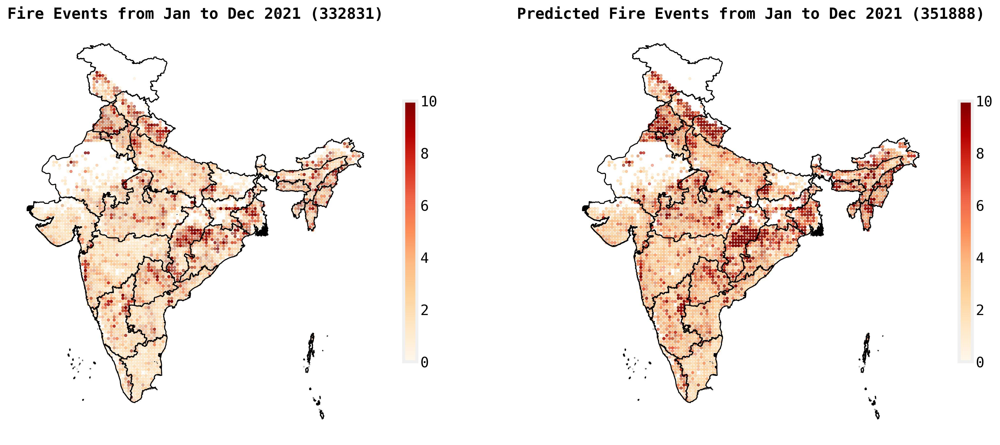
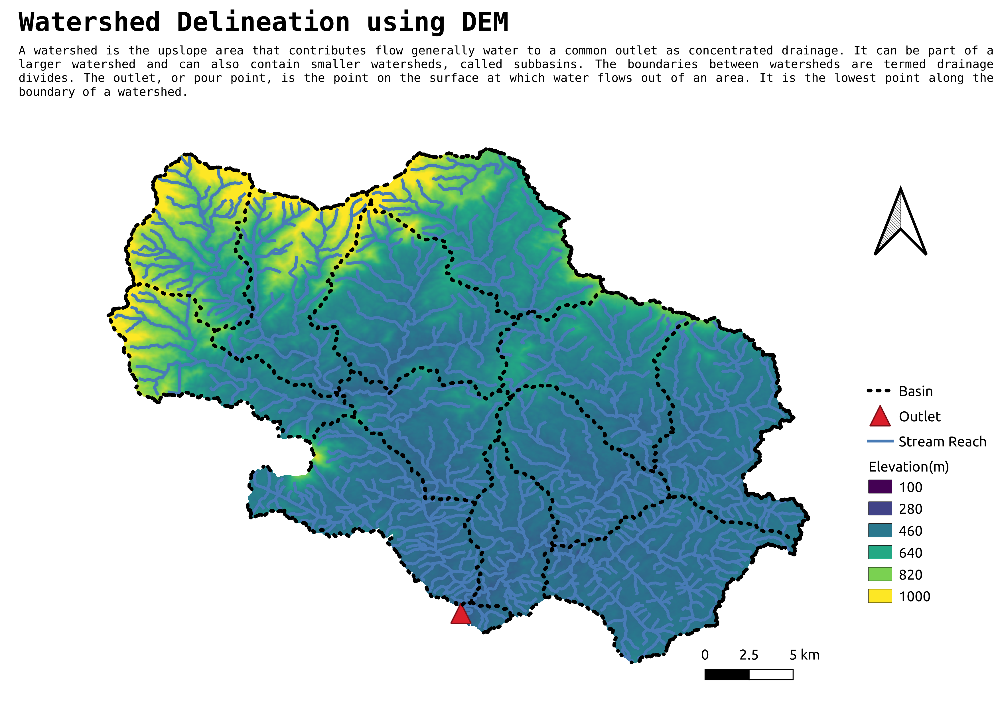
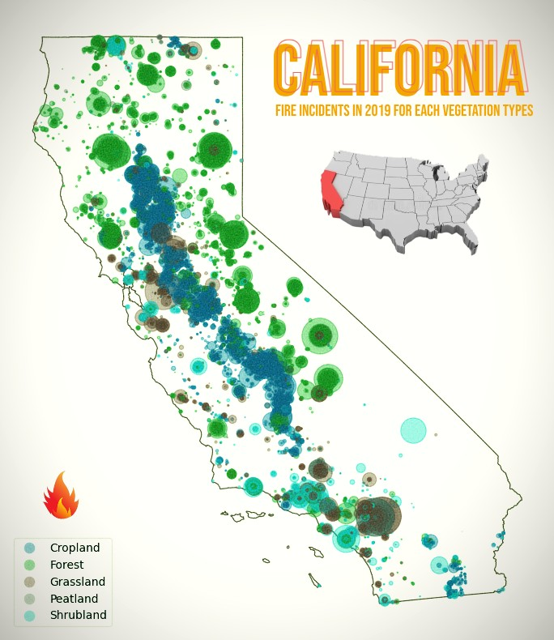
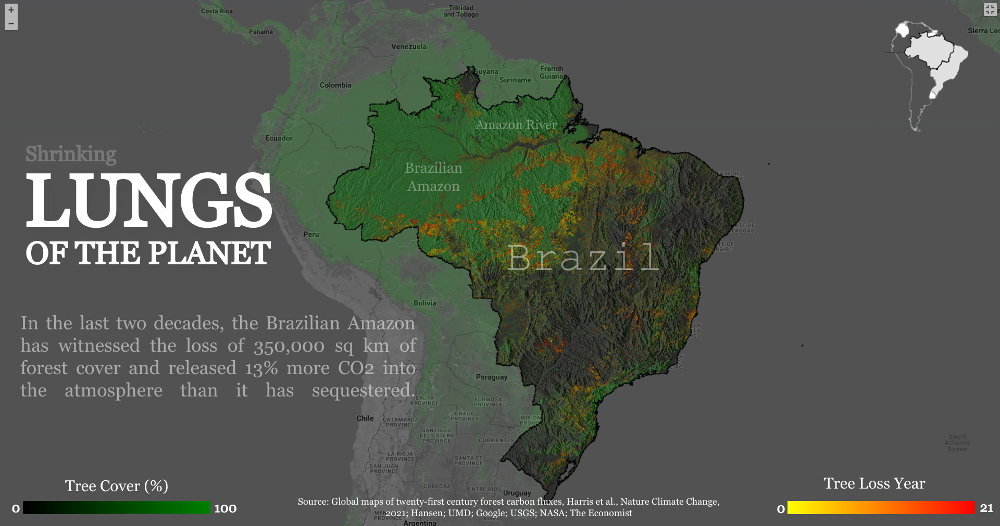
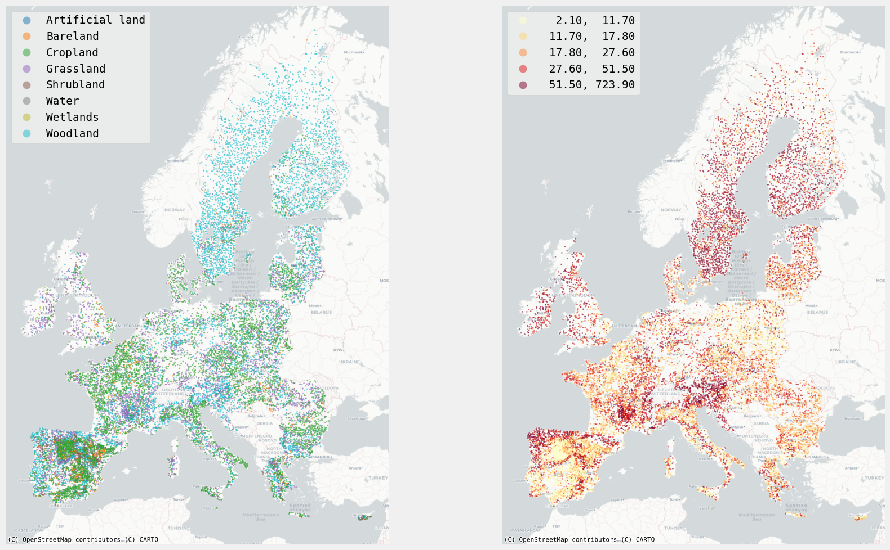
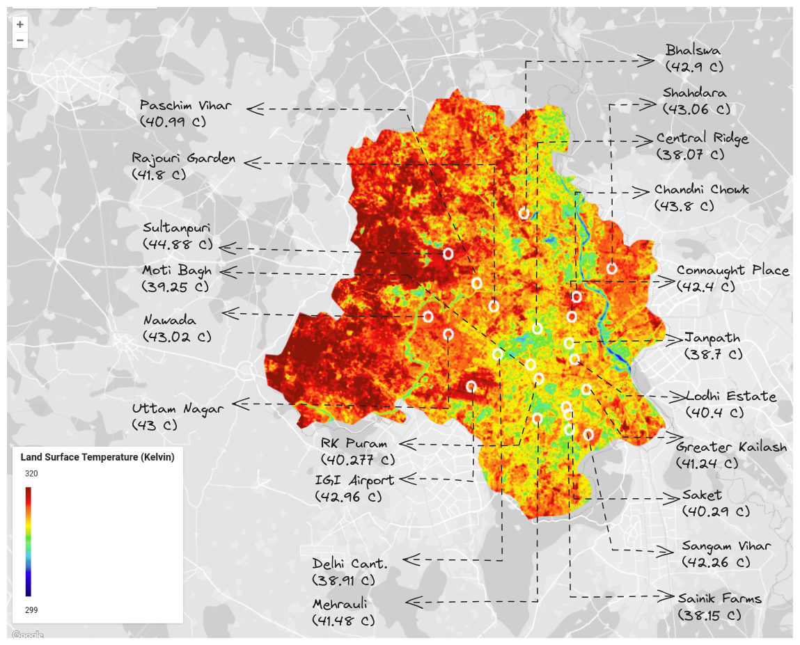
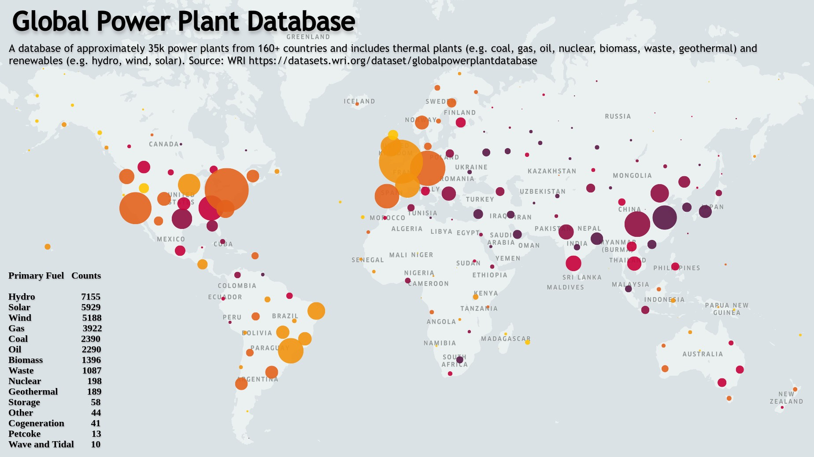

## Day 1 : Points

## Day 2 : Lines

## Day 3 : Polygons

## Day 4 : A Bad Map

## Day 5 : Analog Map

## Day 6 : Asia

## Day 7 : Navigation

## Day 8 : Africa

## Day 9 : Hexagons

## Day 10 : North America

## Day 11 : Retro

## Day 12 : South America

## Day 13 : Choropleth

## Day 14 : Europe

## Day 15 : OpenStreetMap

## Day 16 : Oceania

## Day 17 : Flow

## Day 18 : Atmosphere

## Day 19 : 5-minute map

## Day 20 : Outdoors

## Day 21 : Raster	Pixels

## Day 22 : North is not always up

## Day 23 : 3D	The third dimension

## Day 24 : Black & white

## Day 25 : Antarctica

## Day 26 : Minimal

## Day 27 : Dot	Dot density

## Day 28 : Is this a chart or a map?

## Day 29 : Population

## Day 30 : My favorite..

