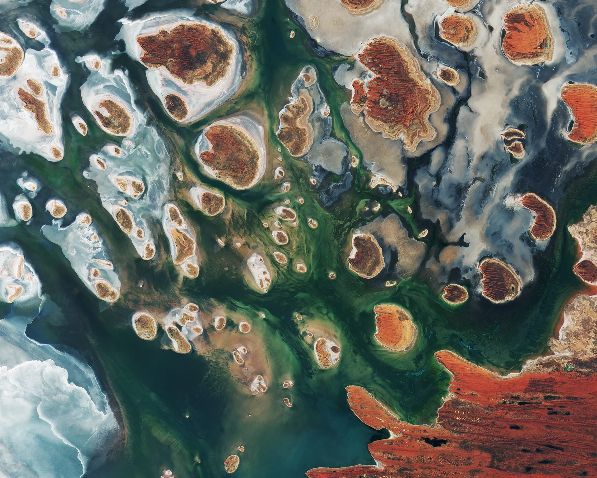

## 💡 Understanding TIFF & GeoTIFF 

[TIFF](https://en.wikipedia.org/wiki/TIFF), also known as Tagged Image File Format, is a raster file format primarily used for bitmap images. A bitmap image comprises differently colored pixels arranged to form an image. TIFF files employ lossless data compression, preserving image quality without significant compression. This format facilitates image editing and resaving without degradation, making it ideal for images requiring frequent modifications.

GeoTIFF extends the TIFF format by incorporating [georeferencing](https://www.usgs.gov/faqs/what-does-georeferenced-mean) information, enabling precise geographic referencing of images. This georeferencing metadata provides spatial context, indicating the Earth locations represented within the image.

## 🤔 Why COG ?

 📦 **Data Size**

Satellite imagery, especially high-resolution datasets like those from Planet or DigitalGlobe, can be substantial, with single strips often exceeding 20 GB. Post-pan sharpening, the size may inflate to 40 GB. Managing such large datasets poses challenges. Cloud Optimized GeoTIFF (COG) addresses this by enabling efficient data retrieval through HTTP GET range requests. Instead of fetching the entire image, COG allows selective retrieval of specific segments, streamlining data access.

 📚 **Reduced Duplication of Data**

COGs facilitate streamlined access to data across diverse software platforms. By serving as a single online resource accessible to various applications, COGs eliminate the need for redundant data copies and caching.

 ⏰ **Image Processing of the fly**

COGs support dynamic image processing through microservices deployed in frameworks like Flask or Django. This capability enables on-the-fly manipulation of images, enhancing flexibility and scalability in geospatial workflows.

## 🧐 What is COG ?

[Cloud Optimized GeoTIFF (COG)](https://www.cogeo.org/) enhances traditional GeoTIFF files by optimizing them for cloud-based workflows. COGs leverage HTTP range requests to efficiently retrieve specific portions of a file, enabling faster and more flexible data access. COGs organize image data internally, starting with metadata followed by optional overview information and the image itself. This structure facilitates streaming and progressive rendering, enhancing performance and usability.

## 🖼 How different is it from regular GeoTIFF.

COGs leverage GeoTIFF's organization capabilities alongside [HTTP GET range requests](https://developer.mozilla.org/en-US/docs/Web/HTTP/Range_requests), enabling clients to retrieve only the required portions of a file. This dynamic fetching minimizes data transfer overheads, enabling online processing without downloading the entire file.

## 🧱 What is Internal Tiling & Internal Overviews ?

COGs utilize internal tiling and overviews for efficient data organization and access. Tiling divides the image into smaller, manageable blocks, enhancing access speed by allowing retrieval of specific areas without reading the entire file. Overviews create downscaled versions of the image, facilitating faster rendering at different zoom levels. Compression further optimizes data storage and retrieval, adhering to best practices for efficient imagery access.

## 🎞 What are HTTP GET Range Requests ?

HTTP GET range requests allow clients to request specific byte ranges from a file hosted on a server. Servers supporting this feature can serve partial file contents based on client requests, reducing data transfer requirements. This capability enhances efficiency, especially for large files like videos and, in the case of COGs, geospatial imagery.

## 🔄 How do we convert a regular GeoTIFF into a Cloud Optimized GeoTIFF?

To convert a regular GeoTIFF to a cloud-optimized format, ensure that the input dataset has generated internal or external overviews. Use the following commands.
    
```bash
gdal_translate input.tiff output.tiff -co TILED=YES -co COPY_SRC_OVERVIEWS=YES -co COMPRESS=LZW
```
    
If the files doesn't have overviews run the below command and then the above command.
    
```bash
gdaladdo -r average input.tiff 2 4 8 16
```

**Here's me giving an overview of cloud optimised geotiff at the first datapub event at TimescaleDB.**

<iframe width="100%" height="800" allowtransparency="true" src="https://www.youtube.com/embed/62OD60PfBUE" frameborder="0" allow="accelerometer; autoplay; encrypted-media; gyroscope; picture-in-picture" allowfullscreen></iframe>