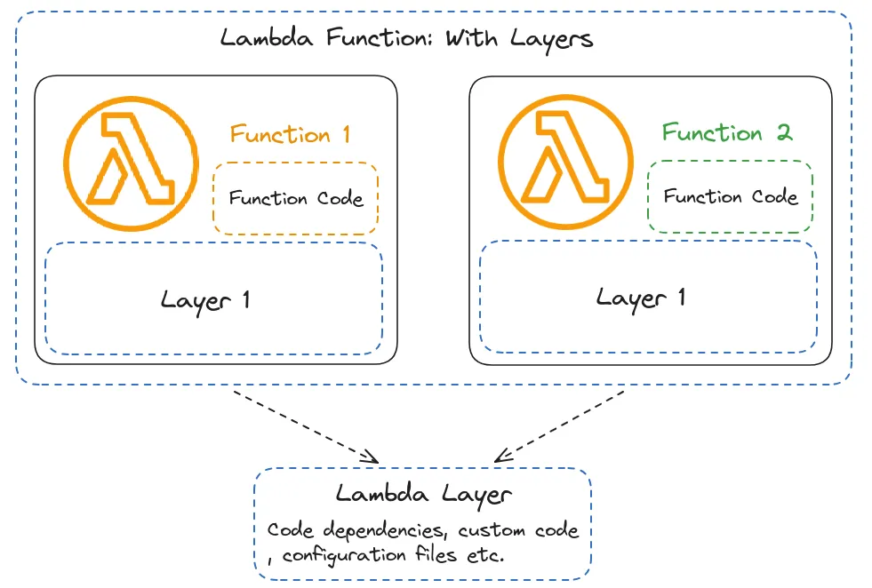
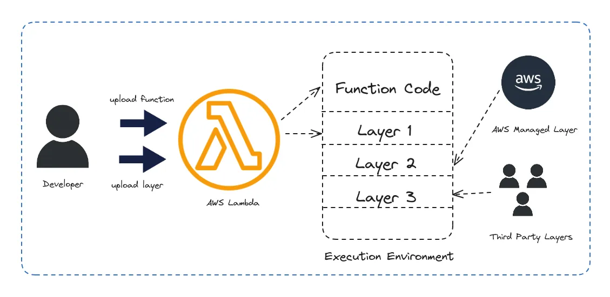
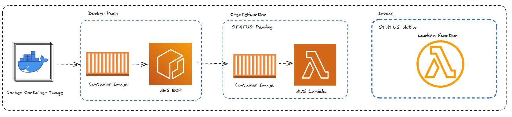
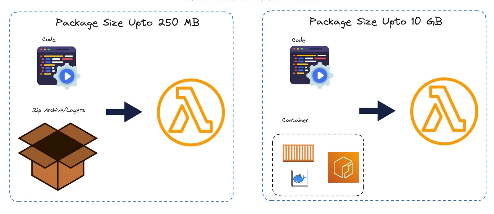

AWS Lambda has been a game-changer in the world of cloud computing since its inception. It revolutionized the way developers approach serverless computing, enabling them to focus solely on writing code without the hassle of managing servers. Over the years, AWS Lambda has undergone significant improvements and added features, making it even more powerful and versatile. Let’s take a journey through the evolution of AWS Lambda and explore its features, challenges, and the recent support for Docker containers.


## The Initial Version of AWS Lambda

When AWS Lambda was first introduced, it offered a groundbreaking approach to serverless computing. The initial version provided the following key features:

- **512MB Space in `/tmp/`**: Lambda functions were allotted a limited space in the `/tmp/` directory for temporary storage.
- **RAM up to 10GB**: Developers could allocate RAM up to 10GB, with proportional CPU resources.
- **15 Minutes Timeout**: Functions had a maximum execution time of 15 minutes.
- **6MB Limit for Response/Request**: Payloads for request and response were capped at 6MB.


**Creating a deployment package**


```bash
# Create a new directory named package into which 
# you will install your dependencies.
mkdir package

# Install your dependencies in the package directory
pip3 install --target ./package pandas

# Create a .zip file with the installed libraries at the root
cd package
zip -r ../my_deployment_package.zip .

# Add the lambda_function.py file to the root of the .zip file
cd ..
zip my_deployment_package.zip lambda_function.py
```

This will give you the following directory structure

```bash
tree -L 1

|__bin
|__dateutil
|__numpy
|__numpy-1.26.4-dist-info
|__pandas
|__pandas-2.2.1-dist-info
|__pytz
|__pytz-2024.1-dist-info
|__lambda_function.py
```

In case you are creating deployment package as a layer, then repeat the same process within a folder named **python** , this is necessary because lambda layer need to follow a specific structure, that is detailed [here](https://docs.aws.amazon.com/lambda/latest/dg/configuration-layers.html) and your deployment package will look something like this.

```bash
tree -L
|_python
 |__bin
 |__dateutil
 |__numpy
 |__numpy-1.26.4-dist-info
 |__pandas
 |__pandas-2.2.1-dist-info
 |__pytz
 |__pytz-2024.1-dist-info
 ```

 In order to keep our deployment package within **50 MB limit**, we need to trim our zip archive. The AWS Lambda environment comes with certain pre-installed Python modules, such as boto3 or botocore ([complete list](https://gist.github.com/gene1wood/4a052f39490fae00e0c3#file-all_aws_lambda_modules-txt)), which are unnecessary for us to include in our package. Therefore, let’s remove them to streamline our deployment.

 ```bash
 # Remove packages which are already part of Lambda env
RUN rm -rdf python/boto3/
RUN rm -rdf python/botocore/

# Additionally remove tests and metadata folders
RUN find python/ -name "*-info" -type d -exec rm -rdf {} +
RUN find python/ -name "tests" -type d -exec rm -rdf {} + 
```

**Creating and updating functions with .zip files using the AWS CLI**

```bash
aws lambda create-function --function-name myFunction \
--runtime python3.12 --handler lambda_function.lambda_handler \
--role arn:aws:iam::111122223333:role/service-role/my-lambda-role \
--zip-file fileb://my_deployment_package.zip
```

## Lambda Layers



**Publish deployment package as layers**



```bash
# Upload the Zip File to Amazon S3
aws s3 cp layer.zip s3://your-bucket-name/layer.zip

# Publish the Zip File as a Lambda Layer
aws lambda publish-layer-version --layer-name "my-python-layer" \
 --description "Sample Python Layer" \
  --content S3Bucket=lambda-layer-bucket,S3Key=layer.zip \
 --license-info "MIT" \ 
 --compatible-runtimes "python3.12"
 ```

 Despite its innovative approach, the initial version of AWS Lambda posed challenges for certain use cases, particularly those relying on compiled code. For example, tasks requiring Python C extensions or shared libraries necessitated cumbersome processes for packaging, especially for geospatial data processing. Libraries like numpy, rasterio, GDAL, geopandas, and Fiona, which involve heavy compiled code, made the compilation process time-consuming. Additionally, the stringent size constraints of Lambda packages often required meticulous cleanup of unused files and scripts, adding complexity to the development process.

 ## AWS Lambda’s Support for Docker Containers



To address the challenges posed by the initial version and to provide more flexibility to developers, [AWS introduced support for Docker containers](https://aws.amazon.com/blogs/aws/new-for-aws-lambda-container-image-support/) in Lambda in AWS Reinvent 2020. With this enhancement, developers gained the ability to package and deploy Lambda functions using Docker images, offering several advantages:

**Local Development Environment**

AWS Lambda offers a variety of base images containing pre-installed runtimes, encompassing Python, NodeJS, Go, Java, Ruby, and .Net. These images are created and maintained by AWS. Using Docker containers, developers can replicate the Lambda execution environment locally. This enables them to develop and test Lambda functions seamlessly on their machines before deploying them to AWS.

```Dockerfile
FROM public.ecr.aws/lambda/python:3.11

COPY main.py .
COPY requirements.txt .
RUN pip3 install -r requirements.txt
CMD ["lambda_function.handler"]
```

To build the Docker image

```bash
docker build -t pylambda .
```

To run the Docker image

```bash
docker run -p 9000:8080 pylambda:latest

# use cURL to send a request.
curl -XPOST "http://localhost:9000/2015-03-31/functions/function/invocations" -d '{"test": "value"}'
```

**Streamlined Packaging**

Docker containers eliminate the need to create complex zip packages, especially for tasks involving compiled code. Developers can leverage existing Docker images tailored for Lambda environments, such as the [lambgeo](https://github.com/lambgeo) or [osgeo-gdal](https://github.com/OSGeo/gdal/tree/master/docker) image, to build and package Lambda functions efficiently.

[Lambgeo](https://github.com/lambgeo) is a Docker image pre-loaded with standard geospatial libraries right of the shelf, and scripts to package them into a zip file that can be uploaded directly to AWS. It greatly simplifies the process to develop and deploy code that uses standard geospatial libraries.

Since we’re utilizing a custom Docker base image, an additional requirement needs to be included in the Dockerfile: the [Lambda Runtime Interface Client](https://docs.aws.amazon.com/lambda/latest/dg/runtimes-images.html), for the respective runtime. In our case, for Python, this requirement is fulfilled by awslambdaric. This lightweight interface facilitates communication between your runtime and the Lambda service and can be installed via pip, making it compatible with Lambda.

To incorporate the AWS Lambda Runtime Interface Client for Python ([awslambdaric](https://github.com/aws/aws-lambda-python-runtime-interface-client)), we’ll install it via pip within the Dockerfile. We’ll set it as the `ENTRYPOINT` of the Docker image to invoke the Client, and then specify the desired handler using the `CMD` argument.

**Lambgeo**

```Dockerfile
ARG VERSION=3.3
FROM lambgeo/lambda-gdal:${VERSION}-python3.8

COPY requirements.txt ./
RUN \
    pip install awslambdaric boto3 botocore; \
    pip install numpy; \
    pip install -r requirements.txt

COPY *.py ./
ENTRYPOINT [ "/var/lang/bin/python3", "-m", "awslambdaric" ]
CMD [ "lambda_function.handler" ]
```

**OSGEO/GDAL**

```Dockerfile
FROM osgeo/gdal:ubuntu-small-3.6.3

COPY requirements.txt ./
ENV DEBIAN_FRONTEND=noninteractive

RUN apt update && \
    apt install -y libpq-dev python3-pip && \
    pip install --upgrade pip && \
    pip install boto3 botocore numpy && \
    pip install -r requirements.txt

WORKDIR /home
COPY *.py ./
ENTRYPOINT [ "/var/lang/bin/python3", "-m", "awslambdaric" ]
CMD [ "lambda_function.handler" ]
```
Build the docker image

```bash
docker build -t pygeolambda .
```

Push the Docker Image to Amazon ECR

```bash
aws ecr get-login-password --region your-region | docker login --username AWS --password-stdin your-account-id.dkr.ecr.your-region.amazonaws.com
docker tag my-lambda-function:latest your-account-id.dkr.ecr.your-region.amazonaws.com/pygeolambda:latest
docker push your-account-id.dkr.ecr.your-region.amazonaws.com/pygeolambda:latest
```

Create or Update Lambda Function Configuration

```bash
aws lambda create-function \
--function-name my-lambda-function \
--package-type Image \
--code ImageUri=your-account-id.dkr.ecr.your-region.amazonaws.com/pygeolambda:latest \
--role your-execution-role-arn \
--timeout 30 \
--memory-size 512
```

**Increased Package Size Limits**



Unlike the traditional Lambda deployment method, where package size was limited, Docker containers offer expanded package size limits of up to 10GB. This alleviates constraints related to size-intensive dependencies and facilitates the inclusion of additional resources within the Lambda function.

## Conclusion

By embracing Docker containers, AWS Lambda has empowered developers to overcome the limitations of the initial version and streamline the development and deployment of serverless applications. With enhanced flexibility and scalability, AWS Lambda continues to be a preferred choice for building resilient and efficient cloud-native solutions.

As Lambda continues to evolve, developers can expect further enhancements and features that simplify development workflows and enable the creation of more sophisticated serverless applications.
