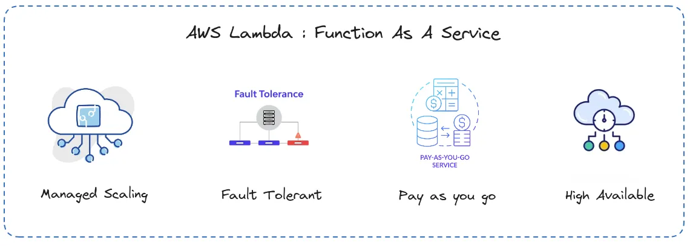
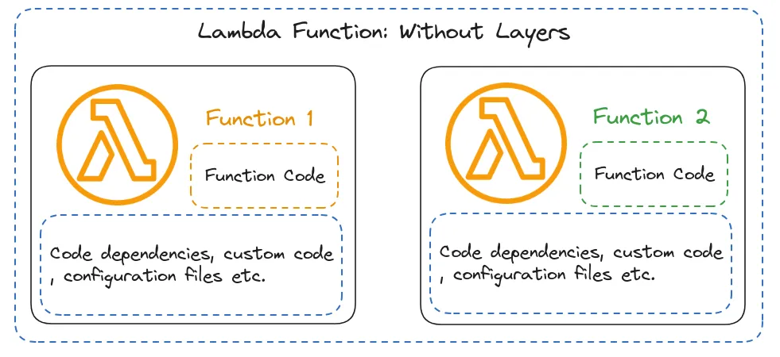
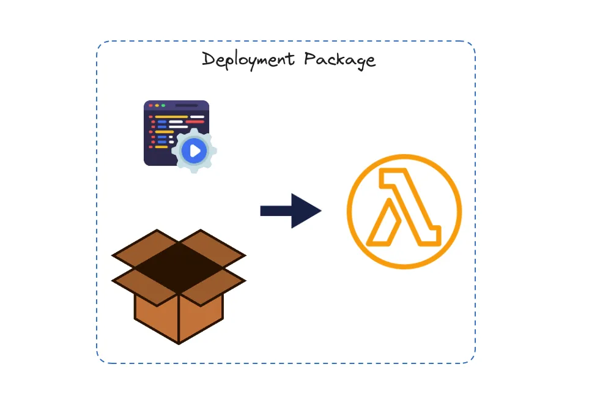

AWS Lambda has been a game-changer in the world of cloud computing since its inception. It revolutionized the way developers approach serverless computing, enabling them to focus solely on writing code without the hassle of managing servers. Over the years, AWS Lambda has undergone significant improvements and added features, making it even more powerful and versatile. Let’s take a journey through the evolution of AWS Lambda and explore its features, challenges, and the recent support for Docker containers.



## The Initial Version of AWS Lambda

When AWS Lambda was first introduced, it offered a groundbreaking approach to serverless computing. The initial version provided the following key features:

- **512MB Space in `/tmp/`**: Lambda functions were allotted a limited space in the /tmp/ directory for temporary storage.
- **RAM up to 10GB**: Developers could allocate RAM up to 10GB, with proportional CPU resources.
- **15 Minutes Timeout**: Functions had a maximum execution time of 15 minutes.
- **6MB Limit for Response/Request**: Payloads for request and response were capped at 6MB.



**Creating a deployment package**



```bash
# Create a new directory named package into which 
# you will install your dependencies.
mkdir package

# Install your dependencies in the package directory
pip3 install --target ./package pandas

# Create a .zip file with the installed libraries at the root
cd package
zip -r ../my_deployment_package.zip .

# Add the lambda_function.py file to the root of the .zip file
cd ..
zip my_deployment_package.zip lambda_function.py
```

This will give you the following directory structure

```bash
tree -L 1

|__bin
|__dateutil
|__numpy
|__numpy-1.26.4-dist-info
|__pandas
|__pandas-2.2.1-dist-info
|__pytz
|__pytz-2024.1-dist-info
|__lambda_function.py
```

In case you are creating deployment package as a layer, then repeat the same process within a folder named **python** , this is necessary because lambda layer need to follow a specific structure, that is detailed here and your deployment package will look something like this.

```bash
tree -L
|_python
 |__bin
 |__dateutil
 |__numpy
 |__numpy-1.26.4-dist-info
 |__pandas
 |__pandas-2.2.1-dist-info
 |__pytz
 |__pytz-2024.1-dist-info
 ```

 In order to keep our deployment package within 50 MB limit, we need to trim our zip archive. The AWS Lambda environment comes with certain pre-installed Python modules, such as boto3 or botocore (complete list), which are unnecessary for us to include in our package. Therefore, let’s remove them to streamline our deployment.

 ```bash
 # Remove packages which are already part of Lambda env
RUN rm -rdf python/boto3/
RUN rm -rdf python/botocore/

# Additionally remove tests and metadata folders
RUN find python/ -name "*-info" -type d -exec rm -rdf {} +
RUN find python/ -name "tests" -type d -exec rm -rdf {} + 
```

**Creating and updating functions with .zip files using the AWS CLI**

```bash
aws lambda create-function --function-name myFunction \
--runtime python3.12 --handler lambda_function.lambda_handler \
--role arn:aws:iam::111122223333:role/service-role/my-lambda-role \
--zip-file fileb://my_deployment_package.zip
```
