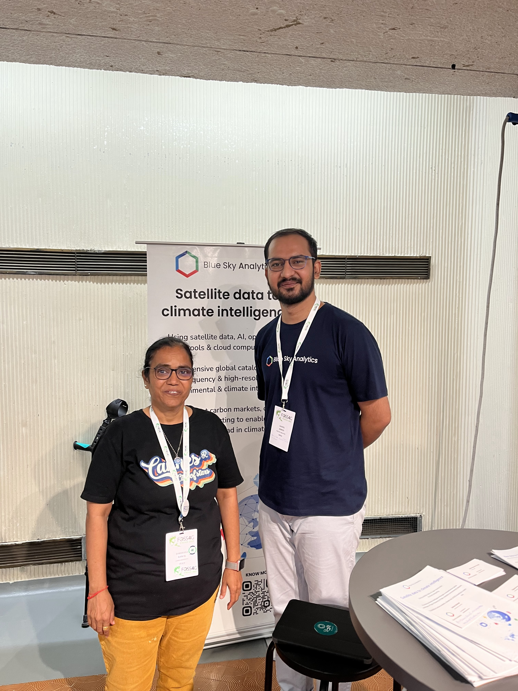
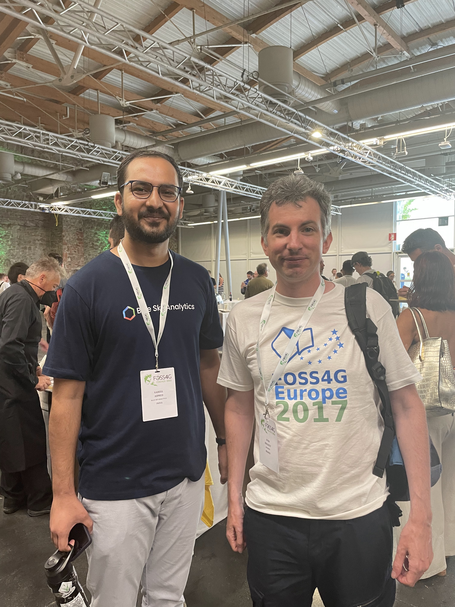
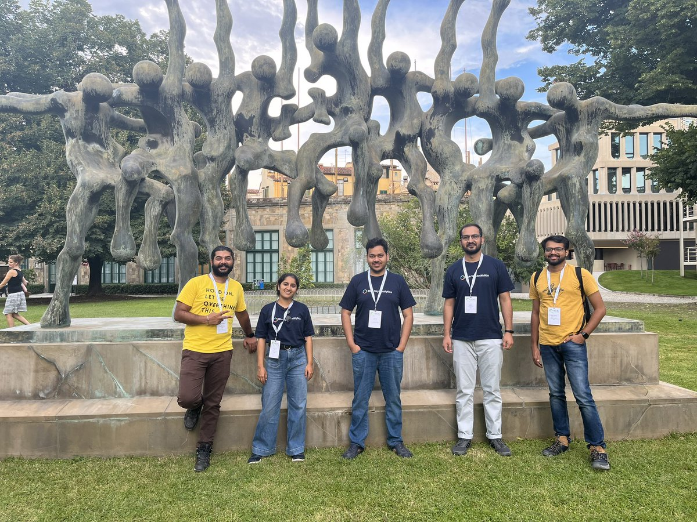

🗣️ Presenting my talk on "*[The Use of Open Source Tools to Estimate Global GHG Emissions](https://talks.osgeo.org/foss4g-2022/talk/R8FHVA/)*" 

Meeting [Even Rouault](https://twitter.com/evenrouault) 😊 !!

Team Blue Sky 😍 !!
